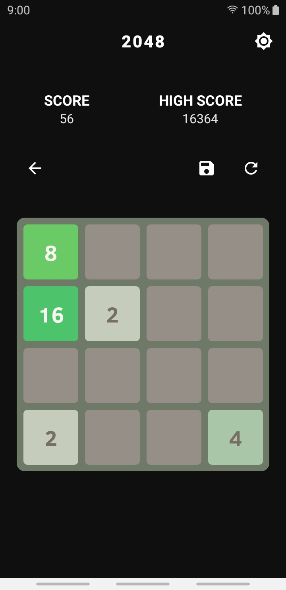
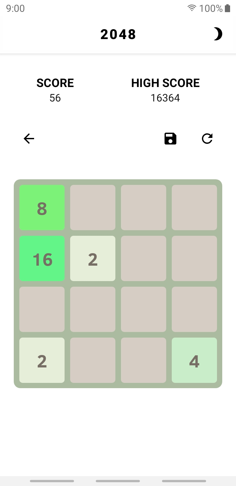

# `2048`
### This project is forked from tpcstld/2048. 


_Ever noticed most of the `2048` games are in yellow and brown? Let's change that a little bit._


<p align="center">
<table border="1">
<tr>
    <td></td>
    <td></td>
</tr>
<tr>
    <td><center> Dark Theme </center></td>
    <td><center> Light Theme </center></td>
</tr>
</table>
</p>

## `Features`

* [X] AD-FREE
* [X] Latest Components
* [X] Green-`ish` Vibe
* [X] Dark Theme with system wide settings
* [X] Persistence
* [ ] Connect with google play games
* [ ] Predictable moves ( no random generation )
* [ ] Optimise for faster fps


## `Contribution`
        
* Fork the repo
* Create a new branch `git checkout -b '$username_$feature'`
* make few changes
* Open a pull request


## `Previously On 2048`

```
2048
====

This is a port of Gabriele Cirulli's 2048 game to Android, all credit for game design goes to him.
Logo redrawn by Margaret Lu.

[Original code](https://github.com/gabrielecirulli/2048) (github.com)

[Download on Google Play](https://play.google.com/store/apps/details?id=com.tpcstld.twozerogame) (play.google.com)

!Use governed by the MIT License.
```